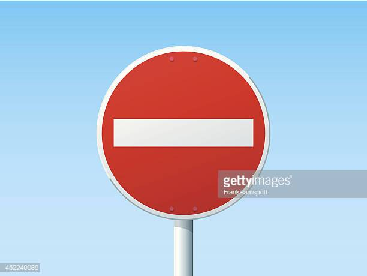
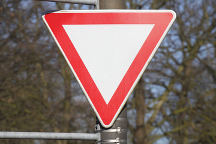
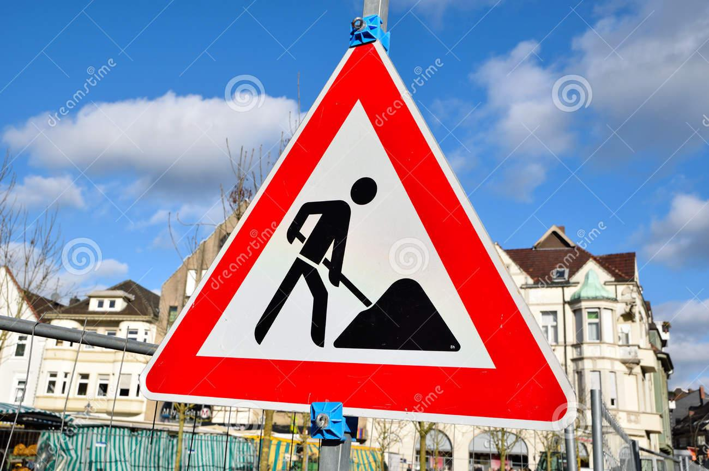
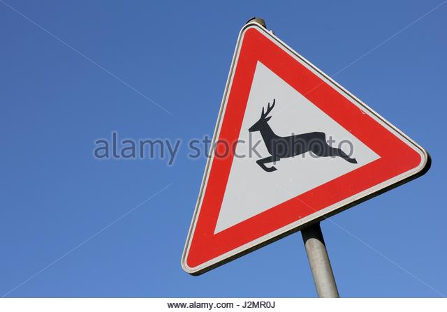
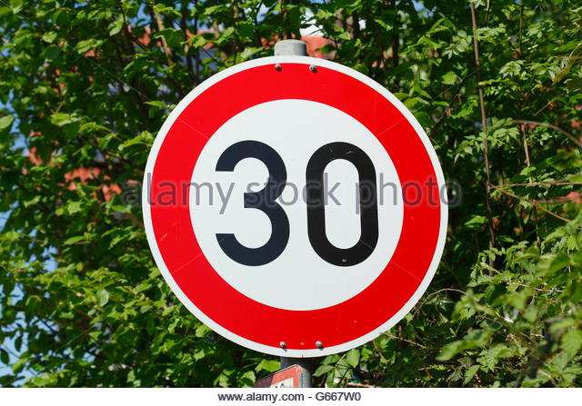
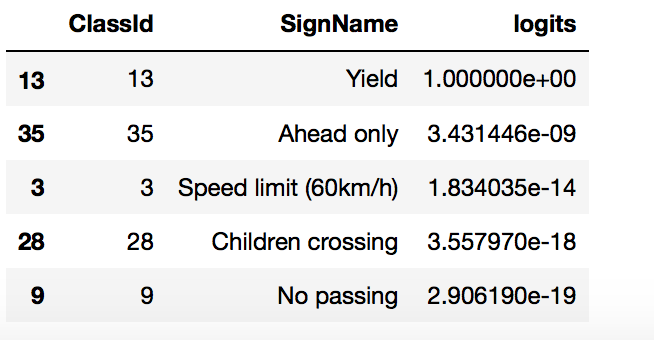
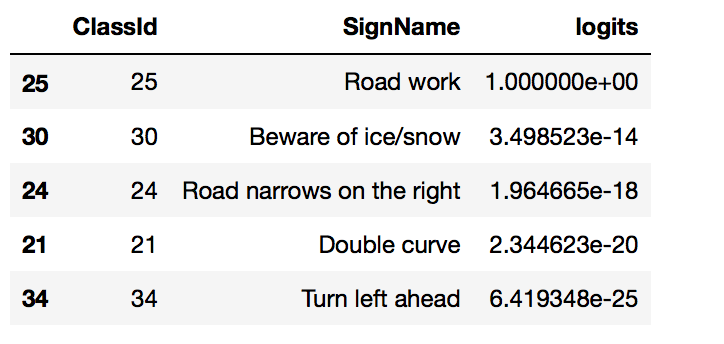
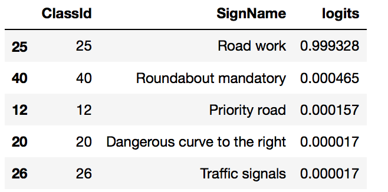
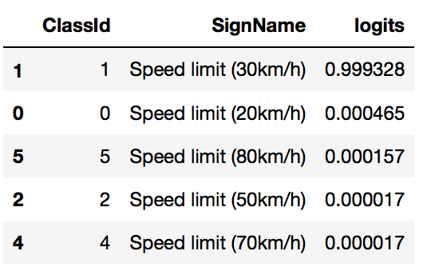

# **Traffic Sign Recognition** 

**Build a Traffic Sign Recognition Project**

The goals / steps of this project are the following:
* Load the data set (see below for links to the project data set)
* Explore, summarize and visualize the data set
* Design, train and test a model architecture
* Use the model to make predictions on new images
* Analyze the softmax probabilities of the new images
* Summarize the results with a written report

[//]: # (Image References)

[image1]: ./examples/training_labels_distribution.png "Distribution of labels in training data set"
[image2]: ./examples/grayscale_example.jpg "Grayscaling"

## Rubric Points
### Here I will consider the [rubric points](https://review.udacity.com/#!/rubrics/481/view) individually and describe how I addressed each point in my implementation.  

---
### Writeup / README

#### 1. Provide a Writeup / README that includes all the rubric points and how you addressed each one. You can submit your writeup as markdown or pdf. You can use this template as a guide for writing the report. The submission includes the project code.

Here is a link to my [project code](https://github.com/julia-kraus/CarND-Traffic-Sign-Classifier-Project/blob/master/Traffic_Sign_Classifier.ipynb)

### Data Set Summary & Exploration

### 1. Desccriptive Statistics

I used the numpy library to calculate summary statistics of the traffic
signs data set:

* The size of training set is 34799
* The size of the validation set is 4410
* The size of test set is 12630
* The shape of a traffic sign image is (32, 32, 3)
* The number of unique classes/labels in the data set is 43

#### 2. Exploratory Visualization

Here is an exploratory visualization of the data set. It is a bar chart showing how the data is distributed 

![alt text][image1]

### Design and Test a Model Architecture

As a first step, I decided to convert the images to grayscale because a) training runs faster if pictures are in grayscale and b) the LeNet architecture requires an image with 32x32 pixels in grayscale.

Here is an example of a traffic sign image before and after grayscaling.

![alt text][image2]

As a last step, I normalized the image data because normalization. Normalization brings all features to a similar range, which helps the algorithm converge faster. 

#### 2. Describe what your final model architecture looks like including model type, layers, layer sizes, connectivity, etc.) Consider including a diagram and/or table describing the final model.

My final model consisted of the following layers:

| Layer         		      |     Description	        					                 | 
|:---------------------:|:---------------------------------------------:| 
| Input         		      | 32x32x1 grayscale image   							             | 
| Convolution 5x5      	| 1x1 stride, valid padding, outputs 28x28x100 	|
| Activation					       |	ReLU								                                  |
| Max pooling	      	   | 2x2 stride,  outputs 14x14x100 				           |
| Convolution 5x5	      | 1x1 stride, valid padding, outputs 10x10x200  |
| Activation            | ReLU                                          |
| Max pooling           | 2x2 stride, outputs 5x5x200                   |
| Convolution 1x1       | 1x1 stride, valid padding outputs 5x5x300     |
| Fully connected		     | 150 neurons                          									|
| Fully connected.      | 84 neurons                                    |
| Softmax				           | 43 classes        									                   |

 

#### 3. Describe how you trained your model. The discussion can include the type of optimizer, the batch size, number of epochs and any hyperparameters such as learning rate.

To train the model, I used an Adam Optimizer with batch gradient descent. The batch size was 128, and I trained the model for 20 epochs. To avoid overfitting, I applied two dropout layers with keep_prob = 0.5. The learning rate was 0.0009.The weights were initialized with a truncated random normal distribution with mu=0 and sigma=0.1.

#### 4. Describe the approach taken for finding a solution and getting the validation set accuracy to be at least 0.93. Include in the discussion the results on the training, validation and test sets and where in the code these were calculated. Your approach may have been an iterative process, in which case, outline the steps you took to get to the final solution and why you chose those steps. Perhaps your solution involved an already well known implementation or architecture. In this case, discuss why you think the architecture is suitable for the current problem.

My final model results were:
* training set accuracy of 99.8%
* validation set accuracy of 94.6%
* test set accuracy of 93.8%

If an iterative approach was chosen:
* I started out with the LeNet architecture as it was demonstrated in the CNN chapter
* The results were not very good. I expected underfitting, so I trained for 20 epochs instead of 12
* To improve the results, I added an extra convolutional layer. 
* To further improve the results, I chose a deeper filter depth in the convolutional layers. 
* The model was already over 90 percent, but there was some overfitting, so I applied dropout after the dense layers. 
* What was the first architecture that was tried and why was it chosen?
* What were some problems with the initial architecture?

The good test score is a good indicator that the model indeed generalizes well to new images.
 

### Test a Model on New Images

#### 1. Choose five German traffic signs found on the web and provide them in the report. For each image, discuss what quality or qualities might be difficult to classify.

Here are five German traffic signs that I found on the web:

 
Some of the images might be hard to classify because the shot has not been taken completely frontally. Apart from that, the images have good resolution and lighting conditions.

#### 2. Discuss the model's predictions on these new traffic signs and compare the results to predicting on the test set. At a minimum, discuss what the predictions were, the accuracy on these new predictions, and compare the accuracy to the accuracy on the test set (OPTIONAL: Discuss the results in more detail as described in the "Stand Out Suggestions" part of the rubric).

Here are the results of the prediction:

| Image			                |     Prediction	        					                  | 
|:-----------------------:|:---------------------------------------------:| 
| No entry      		        | No entry   									                          | 
| Yield     			           | U-turn 										                             |
| Road work					          | Road work											                          |
| 30 km/h	      		        | 30 km/h					 				                             |
| Wild animals crossing			| No passing for vehicles over 3.5 metric tons  |

The model was able to correctly guess 4 of the 5 traffic signs, which gives an accuracy of 80%. This performance is a bit worse than on the test set. 

#### 3. Describe how certain the model is when predicting on each of the five new images by looking at the softmax probabilities for each prediction. Provide the top 5 softmax probabilities for each image along with the sign type of each probability. (OPTIONAL: as described in the "Stand Out Suggestions" part of the rubric, visualizations can also be provided such as bar charts)

The code for making predictions on my final model is starting in the 74th cell of the Ipython notebook.
##### No entry

For the first image, the model is very sure that this is a road work sign sign (probability of 1.0), and the image does contain a road sign. The top five soft max probabilities were:

##### Yield

For the second image, the model is very sure that this is a yield sign sign (probability of 1.0), and the image does contain a yield sign. The top five soft max probabilities were:

For the third image, the model is very sure that this is a road work sign sign (probability of 1.0), and the image does contain a road sign. The top five soft max probabilities were:

For the fourth image, the model is very sure that this is a road work sign sign (probability of 1.0), and the image does contain a road sign. The top five soft max probabilities were:

 

 

For the fifth image, the model is very sure that this is a road work sign sign (probability of 1.0), and the image does contain a road sign. The top five soft max probabilities were:

 

